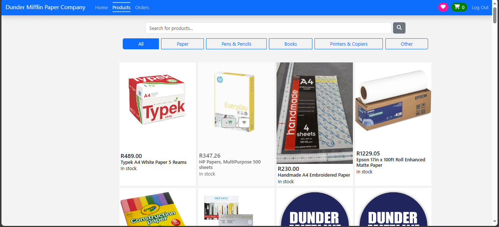
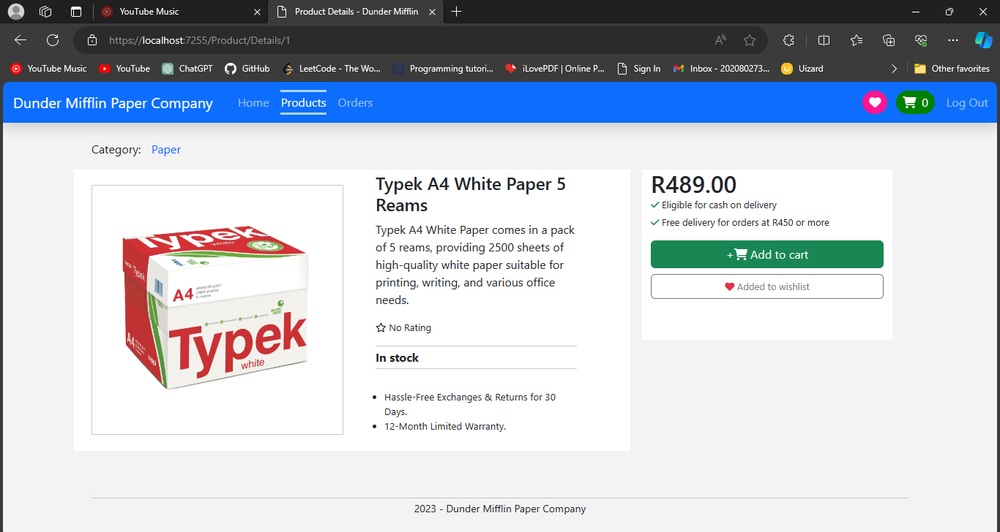
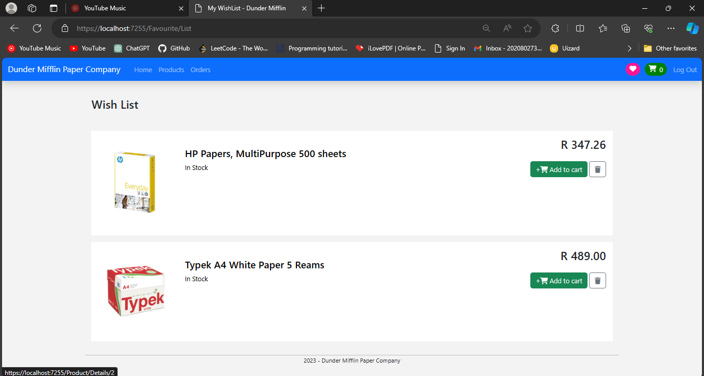

# DunderMifflin
## Dunder Mifflin Paper Company Website

Welcome to the official repository for the fictional Dunder Mifflin Paper Company website! This project is a fictional representation of a paper company's online presence, created for personal practise purposes. The website allows users to explore various paper products and place orders. Also allowing user and inventory management. It is built using C# and ASP .NET Core MVC.

This application has seed data for users thus can be ran and tested on the go. Please note that the project is incomplete and some functionality will not be available.

## Feature Goals
My goal is a website that features the following:
- Users should be able to register and login as a customer (implemented)
- Employees are added by those in roles that have more authority (CEO and Manager) (implemented)
- Customers should be able to view all products, altogether or by category (implemented)
- Customers should be able to view the details of a product, add a product to cart and to wishlist (implemented)
- Customers should be able to place orders and view placed orders (implemented), cancel orders and view the order history
- A CEO should be able to add a manager and a manager a salesperson
- A salesperson should be able to process an order from the list of all placed orders
- A salesperson shoul be able top add a product to inventory, edit the product (image, name, quantity, description)
- Good user experience by adding user friendly error messages and alerts

Note: *Goals not tagged with (implemented) may be partially implemented*

Note: *These goals are subject to change as I build the project and find new ideas to try out*

## Screenshots
The following images show some pages of the website's current status

### Homepage:

### Products:

### Product Details:

### Wishlist:

### Shopping Cart:

## Contact
Please feel to contact me for more information about me or the project or about any opportunities you may have for me on any of the following:

-Email: mpofuoliver1109@gmail.com

-LinkedIn: https://www.linkedin.com/in/olivermpofu/
